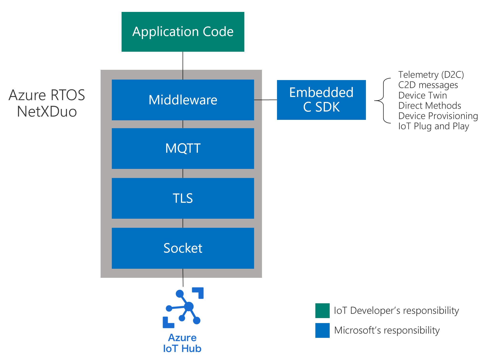

# Azure IoT Middleware for Azure RTOS

Azure IoT Middleware for Azure RTOS is a platform specific library that acts as a binding layer between the Azure RTOS and the [Azure SDK for Embedded C](https://github.com/Azure/azure-sdk-for-c). Goals of this layer are following:

* Expose smart client interfaces (IoTHub_Client, DeviceProvisioning_Client) for the customers, to be consumed in their application.
* Orchestrate the interaction between Embedded C SDK and platform.
* Provide Azure RTOS platform initialization.
* [IoT Plug and Play](https://learn.microsoft.com/azure/iot-develop/overview-iot-plug-and-play) support.
* Security capabilities.
* Resource limitation aware.
* Protocol support.

## Getting Started

See the following samples on how to get started on development boards with Azure IoT Middleware for Azure RTOS:

Manufacturer | Device | Samples |
| --- | --- | --- |
| STMicroelectronics | [STM32F746GDISCOVERY](https://www.st.com/en/evaluation-tools/32f746gdiscovery.html) | [IAR](https://aka.ms/azrtos-sample/f746g-iar) • [STM32Cube](https://aka.ms/azrtos-sample/f746g-cubeide)
| STMicroelectronics | [B-L4S5I-IOT01](https://www.st.com/en/evaluation-tools/b-l4s5i-iot01a.html) / [B-L475E-IOT01](https://www.st.com/en/evaluation-tools/b-l475e-iot01a.html) | [GCC/CMake](https://github.com/eclipse-threadx/getting-started/tree/master/STMicroelectronics/STM32L4_L4%2B) • [IAR](https://aka.ms/azrtos-sample/l4s5-iar) • [STM32Cube](https://aka.ms/azrtos-sample/l4s5-cubeide)
| NXP | [MIMXRT1060-EVK](https://www.nxp.com/design/development-boards/i-mx-evaluation-and-development-boards/mimxrt1060-evk-i-mx-rt1060-evaluation-kit:MIMXRT1060-EVK) | [GCC/CMake](https://github.com/eclipse-threadx/getting-started/tree/master/NXP/MIMXRT1060-EVK) • [IAR](https://aka.ms/azrtos-sample/rt1060-iar) • [MCUXpresso](https://aka.ms/azrtos-sample/rt1060-mcuxpresso)
| Renesas | [RX65N-RSK-2MB](https://www.renesas.com/us/en/products/microcontrollers-microprocessors/rx-32-bit-performance-efficiency-mcus/rx65n-2mb-starter-kit-plus-renesas-starter-kit-rx65n-2mb) | [GCC/CMake](https://github.com/eclipse-threadx/getting-started/tree/master/Renesas/RSK_RX65N_2MB) • [IAR](https://aka.ms/azrtos-samples/rx65n-rsk-2mb-iar) • [E2Studio CCRX](https://aka.ms/azrtos-samples/rx65n-rsk-2mb-ccrx) • [E2Studio GNURX](https://aka.ms/azrtos-samples/rx65n-rsk-2mb-gnurx)
| Renesas | [RX65N-Cloud-Kit](https://www.renesas.com/us/en/products/microcontrollers-microprocessors/rx-32-bit-performance-efficiency-mcus/rx65n-cloud-kit-renesas-rx65n-cloud-kit) | [E2Studio CCRX](https://aka.ms/azrtos-samples/rx65n-ck-ccrx) • [E2Studio GNURX](https://aka.ms/azrtos-samples/rx65n-ck-gnurx)
| Microchip | [ATSAME54-XPRO](https://www.microchip.com/developmenttools/productdetails/atsame54-xpro) | [GCC/CMake](https://github.com/eclipse-threadx/getting-started/tree/master/Microchip/ATSAME54-XPRO) • [IAR](https://aka.ms/azrtos-sample/e54-iar) • [MPLAB](https://aka.ms/azrtos-sample/e54-mplab)
| MXCHIP | [AZ3166](https://aka.ms/iot-devkit) | [GCC/CMake](https://github.com/eclipse-threadx/getting-started/tree/master/MXChip/AZ3166)

## Building

The Azure IoT Middleware for Azure RTOS is built as part of the NetX Duo. Make sure you have defined the following macros in the `CMakeLists.txt` or `nx_user.h` when building it:

Module | Macros |
| --- | --- |
| Azure IoT Middleware for Azure RTOS | `NX_ENABLE_EXTENDED_NOTIFY_SUPPORT`  `NX_SECURE_ENABLE`  `NXD_MQTT_CLOUD_ENABLE`

Follow [`nx_user_sample.h`](https://github.com/eclipse-threadx/netxduo/blob/master/common/inc/nx_user_sample.h) to see how to define these macros in the NetX user header file.

## Features

Azure IoT Middleware for Azure RTOS stays as an addon module for the Azure RTOS NetX Duo. It facilitates the MQTT and TLS stacks that are also as part of NetX Duo addons.

### Basic features 

* Connect to Azure IoT Hub via MQTT.
* Support of IoT Hub primitive data format: [device to cloud (D2C) message](https://learn.microsoft.com/azure/iot-hub/iot-hub-devguide-d2c-guidance), [Device Twins](https://learn.microsoft.com/azure/iot-hub/iot-hub-devguide-device-twins) and [Direct methods](https://learn.microsoft.com/azure/iot-hub/iot-hub-devguide-direct-methods).
* Support of IoT Plug and Play data format: Telemetry, Properties and Commands.
* Authentication: SAS Token and X.509 client certificate.
* JSON parsers.

### Device Update for IoT Hub

[Device Update for IoT Hub](https://learn.microsoft.com/azure/iot-hub-device-update/understand-device-update) is an Azure service that enables you to deploy over-the-air updates (OTA) for your IoT devices. The [Device Update for IoT Hub agent](https://learn.microsoft.com/azure/iot-hub-device-update/device-update-azure-real-time-operating-system) in the IoT Middleware provides simple APIs for device builders to integrate the OTA capability easily.

See the [samples](https://github.com/eclipse-threadx/samples) of semiconductor's hero development boards with detailed guides to learn configure, build and deploy the over-the-air (OTA) updates to the devices.

## APIs

* [nx_azure_iot](./docs/azure_rtos_iot.md)    
* [nx_azure_iot_hub_client](./docs/azure_rtos_iot_hub_client.md)
* [nx_azure_iot_hub_client_properties](./docs/azure_rtos_iot_hub_client_properties.md)
* [nx_azure_iot_provisioning_client](./docs/azure_rtos_iot_provisioning_client.md)
* [nx_azure_iot_json](./docs/azure_rtos_iot_json.md)
* [nx_azure_iot_adu_agent](./docs/azure_rtos_iot_adu_agent.md)

## Need Help?

Find support channels in the [Resources](https://github.com/eclipse-threadx/netxduo#resources) list.

## Licensing

View [Licensing](https://github.com/eclipse-threadx/netxduo#licensing) of Azure RTOS NetX Duo.
