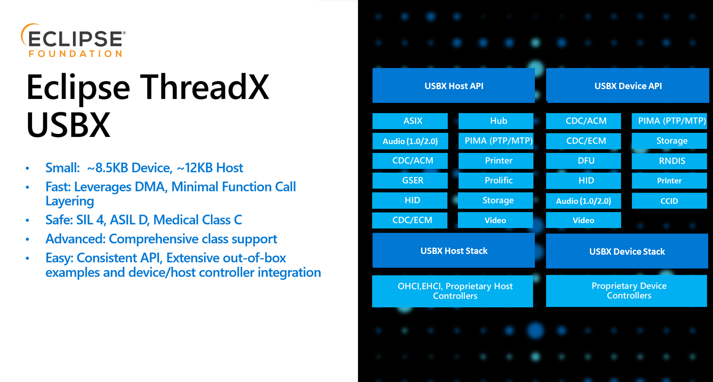

# Eclipse ThreadX USBX

A high-performance USB host, device, and on-the-go (OTG) embedded stack, Eclipse ThreadX USBX is fully integrated with Eclipse ThreadX RTOS and available for all Eclipse ThreadX RTOS–supported processors. Like Eclipse ThreadX RTOS, Eclipse ThreadX USBX is designed to have a small footprint and high performance, making it ideal for deeply embedded applications that require an interface with USB devices.

Here are the key features and modules of USBX:



## Getting Started

Eclipse ThreadX USBX as part of Eclipse ThreadX has been integrated to the semiconductor's SDKs and development environment. You can develop using the tools of choice from [STMicroelectronics](https://www.st.com/content/st_com/en/campaigns/x-cube-azrtos-azure-rtos-stm32.html), [NXP](https://www.nxp.com/design/software/embedded-software/azure-rtos-for-nxp-microcontrollers:AZURE-RTOS), [Renesas](https://github.com/renesas/azure-rtos) and [Microchip](https://mu.microchip.com/get-started-simplifying-your-iot-design-with-azure-rtos).

We also provide [samples](https://github.com/azure-rtos/samples) using hero development boards from semiconductors you can build and test with.

See [Overview of Eclipse ThreadX USBX](https://github.com/eclipse-threadx/rtos-docs/blob/main/rtos-docs/usbx/overview-usbx.md) for the high-level overview.

## Repository Structure and Usage

### Directory layout

    .
    ├── cmake                   # CMakeList files for building the project
    ├── common                  # Core USBX files
    ├── ports                   # Architecture and compiler specific files
    ├── samples                 # Sample codes
    ├── support                 # Misc platform configurations file used by USBX
    ├── LICENSE.txt             # License terms
    ├── LICENSE-HARDWARE.txt    # Licensed hardware from semiconductors
    ├── CONTRIBUTING.md         # Contribution guidance
    └── SECURITY.md             # Repo security guidance

### Branches & Releases

The master branch has the most recent code with all new features and bug fixes. It does not represent the latest General Availability (GA) release of the library. Each official release (preview or GA) will be tagged to mark the commit and push it into the Github releases tab, e.g. `v6.2-rel`.

> When you see xx-xx-xxxx, 6.x or x.x in function header, this means the file is not officially released yet. They will be updated in the next release. See example below.
```
/**************************************************************************/
/*                                                                        */
/*  FUNCTION                                               RELEASE        */
/*                                                                        */
/*    _tx_initialize_low_level                          Cortex-M23/GNU    */
/*                                                           6.x          */
/*  AUTHOR                                                                */
/*                                                                        */
/*    Scott Larson, Microsoft Corporation                                 */
/*                                                                        */
/*  DESCRIPTION                                                           */
/*                                                                        */
/*    This function is responsible for any low-level processor            */
/*    initialization, including setting up interrupt vectors, setting     */
/*    up a periodic timer interrupt source, saving the system stack       */
/*    pointer for use in ISR processing later, and finding the first      */
/*    available RAM memory address for tx_application_define.             */
/*                                                                        */
/*  INPUT                                                                 */
/*                                                                        */
/*    None                                                                */
/*                                                                        */
/*  OUTPUT                                                                */
/*                                                                        */
/*    None                                                                */
/*                                                                        */
/*  CALLS                                                                 */
/*                                                                        */
/*    None                                                                */
/*                                                                        */
/*  CALLED BY                                                             */
/*                                                                        */
/*    _tx_initialize_kernel_enter           ThreadX entry function        */
/*                                                                        */
/*  RELEASE HISTORY                                                       */
/*                                                                        */
/*    DATE              NAME                      DESCRIPTION             */
/*                                                                        */
/*  09-30-2020      Scott Larson            Initial Version 6.1           */
/*  xx-xx-xxxx      Scott Larson            Include tx_user.h,            */
/*                                            resulting in version 6.x    */
/*                                                                        */
/**************************************************************************/ 
```

## Component dependencies

The main components of Eclipse ThreadX are each provided in their own repository, but there are dependencies between them, as shown in the following graph. This is important to understand when setting up your builds.


> You will have to take the dependency graph above into account when building anything other than ThreadX itself.

### Building and using the library

Instruction for building the USBX as static library using Arm GNU Toolchain and CMake. If you are using toolchain and IDE from semiconductor, you might follow its own instructions to use Eclipse ThreadX components as explained in the [Getting Started](#getting-started) section.

1. Install the following tools:

    * [CMake](https://cmake.org/download/) version 3.0 or later
    * [Arm GNU Toolchain for arm-none-eabi](https://developer.arm.com/downloads/-/arm-gnu-toolchain-downloads)
    * [Ninja](https://ninja-build.org/)

1. Build the [ThreadX library](https://github.com/eclipse-threadx/threadx#building-and-using-the-library) as the dependency.

1. Cloning the repo.

    ```bash
    $ git clone https://github.com/eclipse-threadx/usbx.git
    ```

1. Define the features and addons you need in `ux_user.h` and build together with the component source code. You can refer to [`ux_user_sample.h`](https://github.com/eclipse-threadx/usbx/blob/master/common/core/inc/ux_user_sample.h) as an example.

1. Building as a static library

    Each component of Eclipse ThreadX comes with a composable CMake-based build system that supports many different MCUs and host systems. Integrating any of these components into your device app code is as simple as adding a git submodule and then including it in your build using the CMake `add_subdirectory()`.

    While the typical usage pattern is to include USBX into your device code source tree to be built & linked with your code, you can compile this project as a standalone static library to confirm your build is set up correctly.

    An example of building the library for Cortex-M4:

    ```bash
    $ cmake -Bbuild -GNinja -DCMAKE_TOOLCHAIN_FILE=cmake/cortex_m4.cmake .

    $ cmake --build ./build
    ```

## Licensing

License terms for using Eclipse ThreadX are defined in the LICENSE.txt file of this repo. Please refer to this file for all definitive licensing information for all content, incl. the history of this repo.

## Resources

The following are references to additional Eclipse ThreadX resources:

- **Product introduction**: https://github.com/eclipse-threadx/rtos-docs
- **Product issues and bugs, or feature requests**: https://github.com/eclipse-threadx/usbx/issues
- **TraceX Installer**: https://aka.ms/azrtos-tracex-installer

You can also check [previous questions](https://stackoverflow.com/questions/tagged/azure-rtos+usbx) or ask new ones on StackOverflow using the `threadx` and `usbx` tags.

## Security

Eclipse ThreadX provides OEMs with components to secure communication and to create code and data isolation using underlying MCU/MPU hardware protection mechanisms. It is ultimately the responsibility of the device builder to ensure the device fully meets the evolving security requirements associated with its specific use case.

## Contribution

Please follow the instructions provided in the [CONTRIBUTING.md](./CONTRIBUTING.md) for the corresponding repository.
